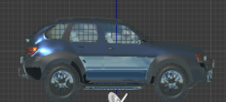
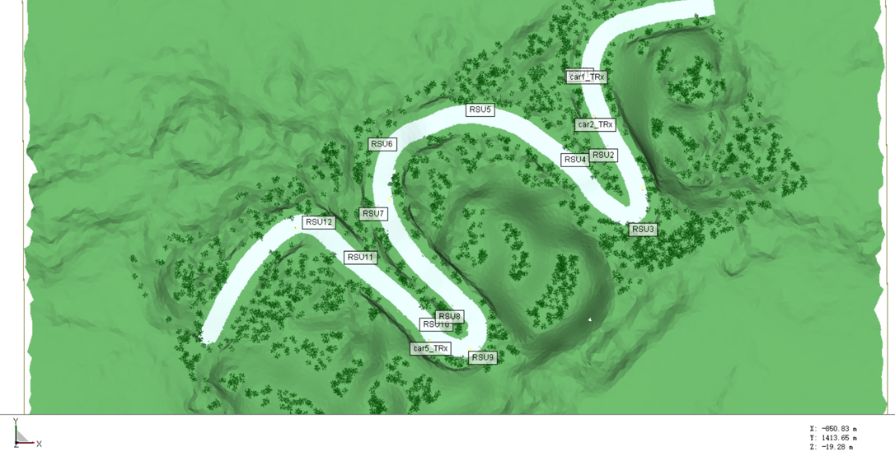
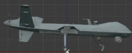

# Air-Ground Multi-Link Cooperative Mountain Road Scenario

## Description

The scenario contains 12 roadside facilities (RSFs) and many trees. The vehicle and UAV are equipped with communication devices and multi-modal sensors, including three cameras, two types of depth cameras (three each), and a LiDAR. The time interval between adjacent snapshots is 50 ms and the frame rate of the multi-modal sensory data at the vehicle is 20 Hz. The frame rate of the communication data is also 20 Hz. The snapshots corresponding to all data are reflected in the filenames, such as "snapshot91_pointcloud.txt" for LiDAR point cloud data at snapshot 91 and "csi_95.mat" for the chanenl matrix at snapshot 95. The total duration of all three scenarios is 75 s with snapshots ranging from 1 to 1500.
A more detailed description of our dataset is given as follows. 

Special case: in the txt files, we set the Z-values of all ground vehicular trajectories to 0.

## Data Collected by Vehicle
 

<strong>Coordinate System Description</strong>

#### **[World Coordinate System]:**

The world coordinate system is a North-East-Down (NED) coordinate system with the X-axis pointing north, the Y-axis pointing east, and the Z-axis pointing downward. It is a right-handed coordinate system, with the origin at the same height as the ground.

#### **[Vehicle Coordinate System]:**

This system includes both vehicles. The X-axis points forward, the Y-axis points to the right, and the Z-axis points downward relative to the vehicle. It is a right-handed coordinate system, with the origin at the center of the vehicle and a certain height relative to the ground.

The position coordinates and heading angles given in the vehicle trajectory txt files represent the position of the vehicle coordinate system's origin in the world coordinate system, as well as the orientation of the vehicle coordinate system relative to the world coordinate system. 
(Special case: in the txt files, we set the z-values of all ground vehicles' trajectories to 0. Before use, it is necessary to subtract the height of the vehicle center relative to the ground to obtain the actual coordinates of the vehicle coordinate system's origin in the world coordinate system.) Additionally, note that pitch, roll, and yaw in the vehicle trajectory txt files are given in radians.

#### **[LiDAR Coordinate System]:**

The coordinate axes align with those of the vehicle system, with the origin offset by a fixed amount relative to the vehicle coordinate system's origin.

#### **[Camera Coordinate System]:**

The coordinate axes by default align with those of the vehicle system. If multiple cameras are mounted on a device, each camera's orientation will be specified. The camera origin is offset by a fixed amount relative to the vehicle coordinate system's origin.

#### **[mmWave Radar Coordinate System]:**

The coordinate axes align with those of the vehicle system, with the origin offset by a fixed amount relative to the vehicle coordinate system's origin.

#### **[Communication Antenna Coordinate System]:**

The coordinate axes align with those of the vehicle system, with the origin offset by a fixed amount relative to the vehicle coordinate system's origin.

 

<strong>Sensor Position</strong>

The scenario includes vehicles of the **"Blue SUV"** type. The relative coordinate positions and parameter information of the sensors are given as follows:

<table>
    <thead>
        <tr>
        <th rowspan="2">Side View</th>
        <th rowspan="2">Name</th>
        <th colspan="8" style="text-align: center;">Camera</th>
        <th colspan="5" style="text-align: center;">LiDAR</th>
        <th colspan="5" style="text-align: center;">mmWave Radar</th>
        </tr>
        <tr>
        <th>Direction</th>
        <th>X(m)</th>
        <th>Y(m)</th>
        <th>Z(m)</th>
        <th>Pitch</th>
        <th>Roll</th>
        <th>Yaw</th>
        <th>FoV Degrees(°)</th>
        <th>X(m)</th>
        <th>Y(m)</th>
        <th>Z(m)</th>
        <th>Vertical FoV(°)</th>
        <th>Horizontal FoV(°)</th>
        <th>X(m)</th>
        <th>Y(m)</th>
        <th>Z(m)</th>
        <th>Vertical FoV(°)</th>
        <th>Horizontal FoV(°)</th>
        </tr>
    </thead>
    <tbody>
        <tr>
        <td></td>
        <td>Blue SUV</td>
        <td>+x</td>
        <td>2</td>
        <td>0</td>
        <td>-1</td>
        <td>0</td>
        <td>0</td>
        <td>0</td>
        <td>100</td>
        <td>0</td>
        <td>0</td>
        <td>-1</td>
        <td>-25~15</td>
        <td>-180~180</td>
        <td>0</td>
        <td>0</td>
        <td>0.8</td>
        <td>-10~10</td>
        <td>-90~90</td>
        </tr>
    </tbody>
</table>
<table>
    <thead>
        <tr>
        <th rowspan="2">Side View</th>
        <th rowspan="2">Name</th>
        <th colspan="3" style="text-align: center;">Communication Equipment</th>
        </tr>
        <tr>
        <th>X(m)</th>
        <th>Y(m)</th>
        <th>Z(m)</th>
        </tr>
    </thead>
    <tbody>
        <tr>
        <td></td>
        <td>Blue SUV</td>
        <td>-0.2</td>
        <td>2</td>
        <td>1.4</td>
        </tr>
    </tbody>
</table>

<table>
  <thead>
    <tr>
      <th rowspan="3">Name</th>
      <th rowspan="3">Direction</th>
      <th colspan="7" style="text-align: center;">Camera</th>
      <th colspan="5" style="text-align: center;">LiDAR</th>
      <th colspan="5" style="text-align: center;">mmWave Radar</th>
    </tr>
    <tr>
      <th>X(m)</th>
      <th>Y(m)</th>
      <th>Z(m)</th>
      <th>Pitch</th>
      <th>Roll</th>
      <th>Yaw</th>
      <th>FoV Degrees(°)</th>
      <th>X(m)</th>
      <th>Y(m)</th>
      <th>Z(m)</th>
      <th>Vertical FoV(°)</th>
      <th>Horizontal FoV(°)</th>
      <th>X(m)</th>
      <th>Y(m)</th>
      <th>Z(m)</th>
      <th>Vertical FoV(°)</th>
      <th>Horizontal FoV(°)</th>
    </tr>
  </thead>
  <tbody>
    <tr>
      <td rowspan="3">RSF</td> <!-- This cell now spans three rows -->
      <td>Left</td>
      <td>0</td>
      <td>0</td>
      <td>-5</td>
      <td>0</td>
      <td>0</td>
      <td>52.5</td>
      <td>75</td>
      <td rowspan="3">0</td>
      <td rowspan="3">0</td>
      <td rowspan="3">-3</td>
      <td rowspan="3">-25~15</td>
      <td rowspan="3">-90~90</td>
      <td rowspan="3">0</td>
      <td rowspan="3">0</td>
      <td rowspan="3">0.8</td>
      <td rowspan="3">-10~10</td>
      <td rowspan="3">-90~90</td>
    </tr>
    <tr>
      <td>Middle</td>
      <td>0</td>
      <td>0</td>
      <td>-5</td>
      <td>0</td>
      <td>0</td>
      <td>0</td>
      <td>110</td>
    </tr>
    <tr>
      <td>Right</td>
      <td>0</td>
      <td>0</td>
      <td>-5</td>
      <td>0</td>
      <td>0</td>
      <td>-52.5</td>
      <td>75</td>
    </tr>
    <!-- Additional rows for other data as needed -->
  </tbody>
</table>
<table>
  <thead>
    <tr>
      <th rowspan="3">Name</th>
      <th colspan="3" style="text-align: center;">Communication Equipment</th>
    </tr>
    <tr>
      <th>X(m)</th>
      <th>Y(m)</th>
      <th>Z(m)</th>
    </tr>
  </thead>
  <tbody>
    <tr>
      <td rowspan="1">RSF</td> <!-- This cell now spans three rows -->
      <td>0.7</td>
      <td>0</td>
      <td>-5</td>
    </tr>
    <!-- Additional rows for other data as needed -->
  </tbody>
</table>

**Direction:** This parameter represents the installation orientation of the sensor in the vehicle coordinate system, which ca n be one of the six directions: +x, -x, +y, -y, +z, -z. It describes the installation location and direction of the sensor relative to the vehicle body.

**X, Y, Z:** These three parameters collectively describe the three-dimensional spatial position of the sensor in the vehicle coordinate system, with the unit in meters. They provide the spatial coordinates of the sensor relative to the vehicle origin.

**Pitch, Roll, Yaw:** These three parameters describe the three rotational angles of the sensor in the vehicle coordinate system, with the unit in degrees. Pitch represents the pitch angle, Roll represents the roll angle, and Yaw represents the yaw angle. They define the spatial attitude of the sensor.

**Field of View (FoV) Degrees(°):** This parameter gives the total field of view angle of the sensor, with the unit in degrees. It reflects the range of the scene that the sensor can perceive.

**Vertical FoV(°):** This parameter gives the vertical field of view angle of the sensor, with the unit in degrees. It defines the sensor's perception range in the vertical direction.

**Horizontal FoV(°):** This parameter gives the horizontal field of view angle of the sensor, with the unit in degrees. It defines the sensor's perception range in the horizontal direction.

 

<strong>Sensor Parameter</strong>

 

The camera and LiDAR sensors deployed on the vehicles in this scenario are of the same type. The specific sensor parameters are as follows:

| **Camera RGB Sensor Parameters**    | **Value** |
|-------------------------------------|-----------|
| **Width**                           | 1920      |
| **Height**                          | 1080      |
| **FOV**                             | 100°      |
| **AutoExpcosureSpeed**              | 100       |
| **AutoExposureBias**                | 0         |
| **AutoExposureMaxBrightness**       | 0.64      |
| **AutoExposureMinBrightness**       | 0.03      |
| **MotionBlurAmount**                | 0         |
| **TargetGamma**                     | 1.0       |

 | **Camera Depth Sensor Parameters** | **Value**                     |
|------------------------------------|-------------------------------|
| **Width**                          | 1920                          |
| **Height**                         | 1080                          |
| **FOV**                            | 100°                          |
| **MotionBlurAmount**               | 0                             |
| **Image Type**                     | DepthPlanner/DepthPerspective |
| **TargetGamma**                    | 1.0                           |
| **OrthoWidth**                     | 5.12                          |

| **LiDAR Sensor Parameters** |  **Value** |
|-----------------------------|-------|
| **NumberOfChannels**        | 16    |
| **HorizontalFOVStart**      | -180°  |
| **HorizontalFOVEnd**        | 180°   |
| **VerticalFOVUpper**        | 15°   |
| **VerticalFOVLower**        | -25°  |

The camera and LiDAR sensors deployed on the RSFs in this scenario are also of the same type. The specific sensor parameters are as follows:

| **Camera RGB Sensor Parameters**    | **Value** |
|-------------------------------------|-----------|
| **Width**                           | 1920      |
| **Height**                          | 1080      |
| **FOV**                             | 100°      |
| **AutoExpcosureSpeed**              | 100       |
| **AutoExposureBias**                | 0         |
| **AutoExposureMaxBrightness**       | 0.64      |
| **AutoExposureMinBrightness**       | 0.03      |
| **MotionBlurAmount**                | 0         |
| **TargetGamma**                     | 1.0       |

 | **Camera Depth Sensor Parameters** | **Value**                     |
|------------------------------------|-------------------------------|
| **Width**                          | 1920                          |
| **Height**                         | 1080                          |
| **FOV**                            | 100°                          |
| **MotionBlurAmount**               | 0                             |
| **Image Type**                     | DepthPlanner/DepthPerspective |
| **TargetGamma**                    | 1.0                           |
| **OrthoWidth**                     | 5.12                          |

| **LiDAR Sensor Parameters** | **Value** |
|-----------------------------|-----------|
| **NumberOfChannels**        | 64        |
| **HorizontalFOVStart**      | -90°       |
| **HorizontalFOVEnd**        | 90°        |
| **VerticalFOVUpper**        | 0°         |
| **VerticalFOVLower**        | -40°       |

The mmWave radar deployed on the vehicles and RSFs in this scenario are of the same type. The specific sensor parameters are as follows:

| **Parameters**             | **Value** |
| -------------------------- | --------- |
| **MIMO Antenna**            | 4 transmitter (Tx) & 3 receiver (Rx)    |
| **StartFrequency**            | 77 GHz    |
| **StopFrequency**             | 81 GHz    |
| **NumberOfChirpsPerFrame** | 101       |
| **ChirpLength**               | 20 μs     |
| **ResetTimeBetweenChirps**  | 0 μs      |
| **FirstSample**               | 2 μs      |
| **SampleSpacing**             | 5 ns      |
| **LastSample**                | 7 μs      |
| **NumberOfSamples**          | 1000      |
|**MaximumDetectionRange**     | 74.9 m|
|**RangeResolution**           |0.1499 m|
|**DopplerVelocityRange**      | ±47.42 m/s|
|**DopplerVelocityResolution** | 0.939 m/s|
| **HorizontalFOVStart**      | -45°      |
| **HorizontalFOVEnd**        | 45°       |
| **VerticalFOVUpper**        | 10°         |
| **VerticalFOVLower**        | -10°       |

Detailed parameters of communication equipment are listed as follows.

| **Parameters**                                               | **Value**                                                                                                                                          |
| ------------------------------------------------------------ |----------------------------------------------------------------------------------------------------------------------------------------------------|
| Antenna type                                                 | SISO (1 antenna at Tx & 1 antenna at Rx)     MIMO (4 antennas at Tx & 4 antennas at Rx)    Massive MIMO (128 antennas at Tx & 32 antennas at Rx)                                                |
| Antenna element spacing                                      | Half wavelength                                                                                                                                    |
| Frequency band                                               | mmWave: 28 GHz carrier frequency with 2 GHz communication bandwidth   Sub-6 GHz: 5.9 GHz carrier frequency with 20 MHz communication bandwidth |                                                              |
| Waveform                                                     | Sinusoid                                                                                                                                           |

 

<strong>RSF Position</strong>

 

The deployment of RSFs is the same across different traffic density scenarios, and the table below describes the positions of RSFs in each scenario.

<table>
  <thead>
    <tr>
      <th>ID</th>
      <th>X(m)</th>
      <th>Y(m)</th>
      <th>Z(m)</th>
      <th>Pitch</th>
      <th>Roll</th>
      <th>Yaw</th>
    </tr>
  </thead>
  <tbody>
    <tr>
      <td>RSF1</td>
      <td>-908.7</td>
      <td>-1640.9</td>
      <td>12.2</td>
      <td>0</td>
      <td>0</td>
      <td>0</td>
    </tr>
    <tr>
      <td>RSF2</td>
      <td>-888.1</td>
      <td>-1570.2</td>
      <td>18.4</td>
      <td>0</td>
      <td>0</td>
      <td>-30</td>
    </tr>
    <tr>
      <td>RSF3</td>
      <td>-855.2</td>
      <td>-1504.5</td>
      <td>16.8</td>
      <td>0</td>
      <td>0</td>
      <td>-120</td>
    </tr>
    <tr>
      <td>RSF4</td>
      <td>-913.8</td>
      <td>-1564.4</td>
      <td>23.8</td>
      <td>0</td>
      <td>0</td>
      <td>130</td>
    </tr>
    <tr>
      <td>RSF5</td>
      <td>-997.3</td>
      <td>-1608.8</td>
      <td>26.0</td>
      <td>0</td>
      <td>0</td>
      <td>100</td>
    </tr>
    <tr>
      <td>RSF6</td>
      <td>-1082.6</td>
      <td>-1579.6</td>
      <td>16.1</td>
      <td>0</td>
      <td>0</td>
      <td>30</td>
    </tr>
      <td>RSF7</td>
      <td>-1090.5</td>
      <td>-1519.3</td>
      <td>3.9</td>
      <td>0</td>
      <td>0</td>
      <td>-10</td>
    </tr>
    <tr>
      <td>RSF8</td>
      <td>-1024.7</td>
      <td>-1429</td>
      <td>4</td>
      <td>0</td>
      <td>0</td>
      <td>-50</td>
    </tr>
    <tr>
      <td>RSF9</td>
      <td>-996.9</td>
      <td>-1392.3</td>
      <td>7.6</td>
      <td>0</td>
      <td>0</td>
      <td>-130</td>
    </tr>
    <tr>
      <td>RSF10</td>
      <td>-1036.9</td>
      <td>-1420.3</td>
      <td>10.2</td>
      <td>0</td>
      <td>0</td>
      <td>135</td>
    </tr>
    <tr>
      <td>RSF11</td>
      <td>-1103.2</td>
      <td>-1479.4</td>
      <td>-2</td>
      <td>0</td>
      <td>0</td>
      <td>135</td>
    </tr>
    <tr>
      <td>RSF12</td>
      <td>-1140</td>
      <td>-1510.9</td>
      <td>-14.7</td>
      <td>0</td>
      <td>0</td>
      <td>135</td>
    </tr>
  </tbody>
</table>
**X, Y, Z:** These three parameters collectively describe the three-dimensional spatial position of the RSF in the scenario, with the unit in meters.

**Pitch, Roll, Yaw:** These three parameters describe the three rotational angles of the RSF in the scenario, with the unit in degrees. Pitch represents the pitch angle, Roll represents the roll angle, and Yaw represents the yaw angle. They define the spatial attitude of the RSF.

 

<strong>Intelligent Agent Trajectory</strong>

The vehicle pose information for each frame is represented as follows:

- The first 3 columns represent the x, y, and z coordinates of the vehicle in that frame, in meters.
- The next 3 columns represent the roll, pitch, and yaw angles of the vehicle in that frame, in radians.
- The last column represents the frame number.

| Traffic Density | Folder Link                                                      |
| --------------- |------------------------------------------------------------------|
| Low             | [Low Traffic Density Folder](./trajectories/Vehicular/low)       |
| Medium          | [Medium Traffic Density Folder](./trajectories/Vehicular/medium) |
| High            | [High Traffic Density Folder](./trajectories/Vehicular/high)     |

It should be noted that the frame interval of each car in the simulation scene is a subset of the 1st frame to the 1500th frame. For example, Car1 enters the scene at the 1st frame and leaves the scene at the 828th frame. The valid frame interval is from the 1st frame to the 827th frame, and the 828th frame to the 1500th frame is an invalid frame interval, which does not provide perception and communication data.
We sort out the valid simulation intervals of each car in this scene as follows.
<table>
  <tr>
    <th rowspan="2">Car id</th>
    <th colspan="2" style="text-align: center;">Sunnyday_Morning_Low intelligent agent density</th>
    <th colspan="2" style="text-align: center;">Sunnyday_Morning_Medium intelligent agent density</th>
    <th colspan="2" style="text-align: center;">Snowyday_Morning_Medium intelligent agent density</th>
    <th colspan="2" style="text-align: center;">Rainyday_Morning_Medium intelligent agent density</th>
    <th colspan="2" style="text-align: center;">Sunnyday_Morning_High intelligent agent density</th>
</tr>
  <tr>
    <th>Start Frame</th>
    <th>Stop Frame</th>
    <th>Start Frame</th>
    <th>Stop Frame</th>
    <th>Start Frame</th>
    <th>Stop Frame</th>
    <th>Start Frame</th>
    <th>Stop Frame</th>
    <th>Start Frame</th>
    <th>Stop Frame</th>
  </tr>
<tr><td>Car1</td><td>1</td><td>1500</td><td>1</td><td>1500</td><td>1</td><td>1500</td><td>1</td><td>1500</td><td>1</td><td>1500</td></tr>
<tr><td>Car2</td><td>1</td><td>1500</td><td>NaN</td><td>NaN</td><td>1</td><td>1500</td><td>1</td><td>1500</td><td>1</td><td>1500</td></tr>
<tr><td>Car3</td><td>1</td><td>1500</td><td>NaN</td><td>NaN</td><td>1</td><td>1500</td><td>1</td><td>1500</td><td>1</td><td>1500</td></tr>
<tr><td>Car4</td><td>1</td><td>1500</td><td>NaN</td><td>NaN</td><td>1</td><td>1500</td><td>1</td><td>1500</td><td>1</td><td>1500</td></tr>
<tr><td>Car5</td><td>1</td><td>1500</td><td>NaN</td><td>NaN</td><td>1</td><td>1500</td><td>1</td><td>1500</td><td>1</td><td>1500</td></tr>
<tr><td>Car6</td><td>NaN</td><td>NaN</td><td>NaN</td><td>NaN</td><td>1</td><td>1500</td><td>1</td><td>1500</td><td>1</td><td>1500</td></tr>
<tr><td>Car7</td><td>NaN</td><td>NaN</td><td>NaN</td><td>NaN</td><td>1</td><td>1500</td><td>1</td><td>1500</td><td>1</td><td>1500</td></tr>
</table>

<strong>Note:</strong> In the table below, "NaN" indicates that The vehicle is not involved in the simulation.

 

## **Data Collected by UAV**

  
<strong>Coordinate System Description</strong>

#### **[World Coordinate System]:**
The world coordinate system is a North-East-Down (NED) coordinate system with the X-axis pointing north, the Y-axis pointing east, and the Z-axis pointing downward. It is a right-handed coordinate system, with the origin at the same height as the ground.

#### **[Vehicle Coordinate System]:**
This system includes both vehicles and UAVs. The X-axis points forward, the Y-axis points to the right, and the Z-axis points downward relative to the vehicle. It is a right-handed coordinate system, with the origin at the center of the vehicle and a certain height relative to the ground.

The position coordinates and heading angles given in the vehicle and UAV trajectory txt files represent the position of the vehicle coordinate system's origin in the world coordinate system, as well as the orientation of the vehicle coordinate system relative to the world coordinate system. 
(Special case: in the txt files, we set the Z-values of all ground vehicles' trajectories to 0. Before use, it is necessary to subtract the height of the vehicle center relative to the ground to obtain the actual coordinates of the vehicle coordinate system's origin in the world coordinate system.) Additionally, note that pitch, roll, and yaw in the vehicle and UAV trajectory txt files are given in radians.

#### **[LiDAR Coordinate System]:**
The coordinate axes align with those of the vehicle system, with the origin offset by a fixed amount relative to the vehicle coordinate system's origin.

#### **[Camera Coordinate System]:**
The coordinate axes by default align with those of the vehicle system. If multiple cameras are mounted on a device, each camera's orientation will be specified. The camera origin is offset by a fixed amount relative to the vehicle coordinate system's origin.

#### **[mmWave Radar Coordinate System]:**
The coordinate axes align with those of the vehicle system, with the origin offset by a fixed amount relative to the vehicle coordinate system's origin.

#### **[Communication Antenna Coordinate System]:**
The coordinate axes align with those of the vehicle system, with the origin offset by a fixed amount relative to the vehicle coordinate system's origin.

 

<strong>Sensor Position</strong>

The scenario includes vehicles of the **"Blue SUV"** type. The relative coordinate positions and parameter information of the sensors are given as follows:

<table>
    <thead>
        <tr>
        <th rowspan="2">Side View</th>
        <th rowspan="2">Name</th>
        <th colspan="8" style="text-align: center;">Camera</th>
        <th colspan="5" style="text-align: center;">LiDAR</th>
        <th colspan="5" style="text-align: center;">mmWave Radar</th>
        </tr>
        <tr>
        <th>Direction</th>
        <th>X(m)</th>
        <th>Y(m)</th>
        <th>Z(m)</th>
        <th>Pitch</th>
        <th>Roll</th>
        <th>Yaw</th>
        <th>FoV Degrees(°)</th>
        <th>X(m)</th>
        <th>Y(m)</th>
        <th>Z(m)</th>
        <th>Vertical FoV(°)</th>
        <th>Horizontal FoV(°)</th>
        <th>X(m)</th>
        <th>Y(m)</th>
        <th>Z(m)</th>
        <th>Vertical FoV(°)</th>
        <th>Horizontal FoV(°)</th>
        </tr>
    </thead>
    <tbody>
        <tr>
        <td></td>
        <td>Blue SUV</td>
        <td>+x</td>
        <td>2</td>
        <td>0</td>
        <td>-1</td>
        <td>0</td>
        <td>0</td>
        <td>0</td>
        <td>100</td>
        <td>0</td>
        <td>0</td>
        <td>-1</td>
        <td>-25~15</td>
        <td>-180~180</td>
        <td>0</td>
        <td>0</td>
        <td>0.8</td>
        <td>-10~10</td>
        <td>-90~90</td>
        </tr>
    </tbody>
</table>
<table>
    <thead>
        <tr>
        <th rowspan="2">Side View</th>
        <th rowspan="2">Name</th>
        <th colspan="3" style="text-align: center;">Communication Equipment</th>
        </tr>
        <tr>
        <th>X(m)</th>
        <th>Y(m)</th>
        <th>Z(m)</th>
        </tr>
    </thead>
    <tbody>
        <tr>
        <td></td>
        <td>Blue SUV</td>
        <td>-0.2</td>
        <td>-2</td>
        <td>-1.4</td>
        </tr>
    </tbody>
</table>

<!-- 无人机感知设备位置 -->
<table>
    <thead>
        <tr>
        <th rowspan="2">Side View</th>
        <th rowspan="2">Name</th>
        <th colspan="8" style="text-align: center;">Camera</th>
        <th colspan="5" style="text-align: center;">LiDAR</th>
        <th colspan="5" style="text-align: center;">mmWave Radar</th>
        </tr>
        <tr>
        <th>Direction</th>
        <th>X(m)</th>
        <th>Y(m)</th>
        <th>Z(m)</th>
        <th>Pitch</th>
        <th>Roll</th>
        <th>Yaw</th>
        <th>FoV Degrees(°)</th>
        <th>X(m)</th>
        <th>Y(m)</th>
        <th>Z(m)</th>
        <th>Vertical FoV(°)</th>
        <th>Horizontal FoV(°)</th>
        <th>X(m)</th>
        <th>Y(m)</th>
        <th>Z(m)</th>
        <th>Vertical FoV(°)</th>
        <th>Horizontal FoV(°)</th>
        </tr>
    </thead>
    <tbody>
        <tr>
        <td></td>
        <td>UAV</td>
        <td>+x</td>
        <td>4</td>
        <td>0</td>
        <td>-2</td>
        <td>0</td>
        <td>0</td>
        <td>0</td>
        <td>100</td>
        <td>0</td>
        <td>0</td>
        <td>-1.9</td>
        <td>-25~15</td>
        <td>-180~180</td>
        <td>0</td>
        <td>0</td>
        <td>0.8</td>
        <td>-10~10</td>
        <td>-90~90</td>
        </tr>
    </tbody>
</table>

<!-- 无人机通信设备位置 -->
<table>
    <thead>
        <tr>
        <th rowspan="2">Side View</th>
        <th rowspan="2">Name</th>
        <th colspan="3" style="text-align: center;">Communication Equipment</th>
        </tr>
        <tr>
        <th>X(m)</th>
        <th>Y(m)</th>
        <th>Z(m)</th>
        </tr>
    </thead>
    <tbody>
        <tr>
        <td></td>
        <td>UAV</td>
        <td>0</td>
        <td>0</td>
        <td>2</td>
        </tr>
    </tbody>
</table>

<table>
  <thead>
    <tr>
      <th rowspan="3">Name</th>
      <th rowspan="3">Direction</th>
      <th colspan="7" style="text-align: center;">Camera</th>
      <th colspan="5" style="text-align: center;">LiDAR</th>
      <th colspan="5" style="text-align: center;">mmWave Radar</th>
    </tr>
    <tr>
      <th>X(m)</th>
      <th>Y(m)</th>
      <th>Z(m)</th>
      <th>Pitch</th>
      <th>Roll</th>
      <th>Yaw</th>
      <th>FoV Degrees(°)</th>
      <th>X(m)</th>
      <th>Y(m)</th>
      <th>Z(m)</th>
      <th>Vertical FoV(°)</th>
      <th>Horizontal FoV(°)</th>
      <th>X(m)</th>
      <th>Y(m)</th>
      <th>Z(m)</th>
      <th>Vertical FoV(°)</th>
      <th>Horizontal FoV(°)</th>
    </tr>
  </thead>
  <tbody>
    <tr>
      <td rowspan="3">RSF</td> <!-- This cell now spans three rows -->
      <td>Left</td>
      <td>0</td>
      <td>0</td>
      <td>-5</td>
      <td>0</td>
      <td>0</td>
      <td>52.5</td>
      <td>75</td>
      <td rowspan="3">0</td>
      <td rowspan="3">0</td>
      <td rowspan="3">-3</td>
      <td rowspan="3">-25~15</td>
      <td rowspan="3">-90~90</td>
      <td rowspan="3">0</td>
      <td rowspan="3">0</td>
      <td rowspan="3">0.8</td>
      <td rowspan="3">-10~10</td>
      <td rowspan="3">-90~90</td>
    </tr>
    <tr>
      <td>Middle</td>
      <td>0</td>
      <td>0</td>
      <td>-5</td>
      <td>0</td>
      <td>0</td>
      <td>0</td>
      <td>110</td>
    </tr>
    <tr>
      <td>Right</td>
      <td>0</td>
      <td>0</td>
      <td>-5</td>
      <td>0</td>
      <td>0</td>
      <td>-52.5</td>
      <td>75</td>
    </tr>
    <!-- Additional rows for other data as needed -->
  </tbody>
</table>

<table>
  <thead>
    <tr>
      <th rowspan="3">Name</th>
      <th colspan="3" style="text-align: center;">Communication Equipment</th>
    </tr>
    <tr>
      <th>X(m)</th>
      <th>Y(m)</th>
      <th>Z(m)</th>
    </tr>
  </thead>
  <tbody>
    <tr>
      <td rowspan="1">RSF</td> <!-- This cell now spans three rows -->
      <td>0.7</td>
      <td>0</td>
      <td>-5</td>
    </tr>
    <!-- Additional rows for other data as needed -->
  </tbody>
</table>

**Direction:** This parameter represents the installation orientation of the sensor in the vehicle coordinate system, which can be one of the six directions: +x, -x, +y, -y, +z, -z. It describes the installation location and direction of the sensor relative to the vehicle body.

**X, Y, Z:** These three parameters collectively describe the three-dimensional spatial position of the sensor in the vehicle coordinate system, with the unit in meters. They provide the spatial coordinates of the sensor relative to the vehicle origin.

**Pitch, Roll, Yaw:** These three parameters describe the three rotational angles of the sensor in the vehicle coordinate system, with the unit in degrees. Pitch represents the pitch angle, Roll represents the roll angle, and Yaw represents the yaw angle. They define the spatial attitude of the sensor.

**Field of View (FoV) Degrees(°):** This parameter gives the total field of view angle of the sensor, with the unit in degrees. It reflects the range of the scene that the sensor can perceive.

**Vertical FoV(°):** This parameter gives the vertical field of view angle of the sensor, with the unit in degrees. It defines the sensor's perception range in the vertical direction.

**Horizontal FoV(°):** This parameter gives the horizontal field of view angle of the sensor, with the unit in degrees. It defines the sensor's perception range in the horizontal direction.

 

<strong>Sensor Parameter</strong>

The camera and LiDAR sensors deployed on the vehicles in this scenario are of the same type. The specific sensor parameters are as follows:

| **Camera RGB Sensor Parameters**    | **Value** |
|-------------------------------------|-----------|
| **Width**                           | 1920      |
| **Height**                          | 1080      |
| **FOV**                             | 100°      |
| **AutoExpcosureSpeed**              | 100       |
| **AutoExposureBias**                | 0         |
| **AutoExposureMaxBrightness**       | 0.64      |
| **AutoExposureMinBrightness**       | 0.03      |
| **MotionBlurAmount**                | 0         |
| **TargetGamma**                     | 1.0       |

 | **Camera Depth Sensor Parameters** | **Value**                     |
|------------------------------------|-------------------------------|
| **Width**                          | 1920                          |
| **Height**                         | 1080                          |
| **FOV**                            | 100°                          |
| **MotionBlurAmount**               | 0                             |
| **Image Type**                     | DepthPlanner/DepthPerspective |
| **TargetGamma**                    | 1.0                           |
| **OrthoWidth**                     | 5.12                          |

| **LiDAR Sensor Parameters** |  **Value**  |
|-----------------------------|-------|
| **NumberOfChannels**        | 16    |
| **HorizontalFOVStart**      | -180°  |
| **HorizontalFOVEnd**        | 180°   |
| **VerticalFOVUpper**        | 15°    |
| **VerticalFOVLower**        | -25°   |

The camera and LiDAR sensors deployed on the UAVs in this scenario are of the same type. The specific sensor parameters are as follows:

| **Camera RGB Sensor Parameters**    | **Value** |
|-------------------------------------|-----------|
| **Width**                           | 1920      |
| **Height**                          | 1080      |
| **FOV**                             | 100°      |
| **AutoExpcosureSpeed**              | 100       |
| **AutoExposureBias**                | 0         |
| **AutoExposureMaxBrightness**       | 0.64      |
| **AutoExposureMinBrightness**       | 0.03      |
| **MotionBlurAmount**                | 0         |
| **TargetGamma**                     | 1.0       |

 | **Camera Depth Sensor Parameters** | **Value**                    |
|------------------------------------|------------------------------|
| **Width**                          | 1920                         |
| **Height**                         | 1080                         |
| **FOV**                            | 100°                          |
| **MotionBlurAmount**               | 0                            |
| **Image Type**                     | DepthPlanner/DepthPerspective |
| **TargetGamma**                    | 1.0                          |
| **OrthoWidth**                     | 5.12                         |

| **LiDAR Sensor Parameters** | **Value** |
|-----------------------------|-----------|
| **NumberOfChannels**        | 16        |
| **HorizontalFOVStart**      | -180°      |
| **HorizontalFOVEnd**        | 180°       |
| **VerticalFOVUpper**        | 0°         |
| **VerticalFOVLower**        | -75°       |

The camera and LiDAR sensors deployed on the RSFs in this scenario are also of the same type. The specific sensor parameters are as follows:

| **Camera RGB Sensor Parameters**    | **Value** |
|-------------------------------------|----------|
| **Width**                           | 1920     |
| **Height**                          | 1080     |
| **FOV**                             | 100°      |
| **AutoExpcosureSpeed**              | 100      |
| **AutoExposureBias**                | 0        |
| **AutoExposureMaxBrightness**       | 0.64     |
| **AutoExposureMinBrightness**       | 0.03     |
| **MotionBlurAmount**                | 0        |
| **TargetGamma**                     | 1.0      |

 | **Camera Depth Sensor Parameters** | **Value**                     |
|------------------------------------|-------------------------------|
| **Width**                          | 1920                          |
| **Height**                         | 1080                          |
| **FOV**                            | 100°                          |
| **MotionBlurAmount**               | 0                             |
| **Image Type**                     | DepthPlanner/DepthPerspective |
| **TargetGamma**                    | 1.0                           |
| **OrthoWidth**                     | 5.12                          |

| **LiDAR Sensor Parameters** | **Value** |
|-----------------------------|-----------|
| **NumberOfChannels**        | 64        |
| **HorizontalFOVStart**      | -90°       |
| **HorizontalFOVEnd**        | 90°       |
| **VerticalFOVUpper**        | 0°         |
| **VerticalFOVLower**        | -40°       |

The mmWave radar deployed on UAVs in this scenario are of the same type. The specific sensor parameters are as follows:

| **Parameters**             | **Value** |
| -------------------------- | --------- |
| **SISO Antenna**            | 1 transmitter (Tx) & 1 receiver (Rx)    |
| **StartFrequency**            | 77 GHz    |
| **StopFrequency**             | 81 GHz    |
| **NumberOfChirpsPerFrame** | 101       |
| **ChirpLength**               | 20 μs     |
| **ResetTimeBetweenChirps**  | 0 μs      |
| **FirstSample**               | 2 μs      |
| **SampleSpacing**             | 2.5 ns      |
| **LastSample**                | 4.5 μs      |
| **NumberOfSamples**          | 1000      |
|**MaximumDetectionRange**     | 149.9 m|
|**RangeResolution**           |0.2997 m|
|**DopplerVelocityRange**      | ±47.42 m/s|
|**DopplerVelocityResolution** | 0.939 m/s|
| **HorizontalFOVStart**      | -45°      |
| **HorizontalFOVEnd**        | 45°       |
| **VerticalFOVUpper**        | 45°         |
| **VerticalFOVLower**        | -45°       |

The mmWave radar deployed on the vehicles and RSFs in this scenario are of the same type. The specific sensor parameters are as follows:

| **Parameters**             | **Value** |
| -------------------------- | --------- |
| **MIMO Antenna**            | 4 transmitter (Tx) & 3 receiver (Rx)    |
| **StartFrequency**            | 77 GHz    |
| **StopFrequency**             | 81 GHz    |
| **NumberOfChirpsPerFrame** | 101       |
| **ChirpLength**               | 20 μs     |
| **ResetTimeBetweenChirps**  | 0 μs      |
| **FirstSample**               | 2 μs      |
| **SampleSpacing**             | 5 ns      |
| **LastSample**                | 7 μs      |
| **NumberOfSamples**          | 1000      |
|**MaximumDetectionRange**     | 74.9 m|
|**RangeResolution**           |0.1499 m|
|**DopplerVelocityRange**      | ±47.42 m/s|
|**DopplerVelocityResolution** | 0.939 m/s|
| **HorizontalFOVStart**      | -45°      |
| **HorizontalFOVEnd**        | 45°       |
| **VerticalFOVUpper**        | 10°         |
| **VerticalFOVLower**        | -10°       |

Detailed parameters of communication equipment are listed as follows.

| **Parameters**                                               | **Value**                                                                                                                                          |
| ------------------------------------------------------------ |----------------------------------------------------------------------------------------------------------------------------------------------------|
| Antenna type                                                 | SISO (1 antenna at Tx & 1 antenna at Rx)     MIMO (4 antennas at Tx & 4 antennas at Rx)    Massive MIMO (128 antennas at Tx & 32 antennas at Rx)                                                |
| Antenna element spacing                                      | Half wavelength                                                                                                                                    |
| Frequency band                                               | mmWave: 28 GHz carrier frequency with 2 GHz communication bandwidth   Sub-6 GHz: 5.9 GHz carrier frequency with 20 MHz communication bandwidth |                                                              |
| Waveform                                                     | Sinusoid                                                                                                                                           |

 

<strong>RSF Position</strong>

 

The deployment of RSFs is the same across different traffic density scenarios, and the table below describes the positions of RSFs in each scenario.

<table>
  <thead>
    <tr>
      <th>ID</th>
      <th>X(m)</th>
      <th>Y(m)</th>
      <th>Z(m)</th>
      <th>Pitch</th>
      <th>Roll</th>
      <th>Yaw</th>
    </tr>
  </thead>
  <tbody>
    <tr>
      <td>RSF1</td>
      <td>-908.7</td>
      <td>-1640.9</td>
      <td>12.2</td>
      <td>0</td>
      <td>0</td>
      <td>0</td>
    </tr>
    <tr>
      <td>RSF2</td>
      <td>-888.1</td>
      <td>-1570.2</td>
      <td>18.4</td>
      <td>0</td>
      <td>0</td>
      <td>-30</td>
    </tr>
    <tr>
      <td>RSF3</td>
      <td>-855.2</td>
      <td>-1504.5</td>
      <td>16.8</td>
      <td>0</td>
      <td>0</td>
      <td>-120</td>
    </tr>
    <tr>
      <td>RSF4</td>
      <td>-913.8</td>
      <td>-1564.4</td>
      <td>23.8</td>
      <td>0</td>
      <td>0</td>
      <td>130</td>
    </tr>
    <tr>
      <td>RSF5</td>
      <td>-997.3</td>
      <td>-1608.8</td>
      <td>26.0</td>
      <td>0</td>
      <td>0</td>
      <td>100</td>
    </tr>
    <tr>
      <td>RSF6</td>
      <td>-1082.6</td>
      <td>-1579.6</td>
      <td>16.1</td>
      <td>0</td>
      <td>0</td>
      <td>30</td>
    </tr>
      <td>RSF7</td>
      <td>-1090.5</td>
      <td>-1519.3</td>
      <td>3.9</td>
      <td>0</td>
      <td>0</td>
      <td>-10</td>
    </tr>
    <tr>
      <td>RSF8</td>
      <td>-1024.7</td>
      <td>-1429</td>
      <td>4</td>
      <td>0</td>
      <td>0</td>
      <td>-50</td>
    </tr>
    <tr>
      <td>RSF9</td>
      <td>-996.9</td>
      <td>-1392.3</td>
      <td>7.6</td>
      <td>0</td>
      <td>0</td>
      <td>-130</td>
    </tr>
    <tr>
      <td>RSF10</td>
      <td>-1036.9</td>
      <td>-1420.3</td>
      <td>10.2</td>
      <td>0</td>
      <td>0</td>
      <td>135</td>
    </tr>
    <tr>
      <td>RSF11</td>
      <td>-1103.2</td>
      <td>-1479.4</td>
      <td>-2</td>
      <td>0</td>
      <td>0</td>
      <td>135</td>
    </tr>
    <tr>
      <td>RSF12</td>
      <td>-1140</td>
      <td>-1510.9</td>
      <td>-14.7</td>
      <td>0</td>
      <td>0</td>
      <td>135</td>
    </tr>
  </tbody>
</table>
**X, Y, Z:** These three parameters collectively describe the three-dimensional spatial position of the RSF in the scenario, with the unit in meters.

**Pitch, Roll, Yaw:** These three parameters describe the three rotational angles of the RSF in the scenario, with the unit in degrees. Pitch represents the pitch angle, Roll represents the roll angle, and Yaw represents the yaw angle. They define the spatial attitude of the RSF.

 

<strong>Intelligent Agent Trajectory</strong>

The vehicle pose information for each frame is represented as follows:

- The first 3 columns represent the x, y, and z coordinates of the vehicle in that frame, in meters.
- The next 3 columns represent the roll, pitch, and yaw angles of the vehicle in that frame, in radians.
- The last column represents the frame number.

| Traffic Density | Folder Link                                                |
| --------------- |------------------------------------------------------------|
| Medium          | [Medium Traffic Density Folder](./trajectories/UAV/medium) |

It should be noted that the frame interval of each car in the simulation scene is a subset of the 1st frame to the 1500th frame. For example, Car1 enters the scene at the 1st frame and leaves the scene at the 828th frame. The valid frame interval is from the 1st frame to the 827th frame, and the 828th frame to the 1500th frame is an invalid frame interval, which does not provide perception and communication data.
We sort out the valid simulation intervals of each car in this scene as follows.
<table>
  <tr>
    <th rowspan="2">Car id</th>
    <th colspan="2" style="text-align: center;">Sunnyday_Morning_Medium intelligent agent density</th>
</tr>
  <tr>
            <th>Start Frame</th>
            <th>Stop Frame</th>
  </tr>
        <tr><td>Car5</td><td>1</td><td>1500</td></tr>
        <tr><td>UAV1</td><td>1</td><td>1500</td></tr>
</table>

<strong>Note:</strong> In the table below, "NaN" indicates that The vehicle is not involved in the simulation.

 
